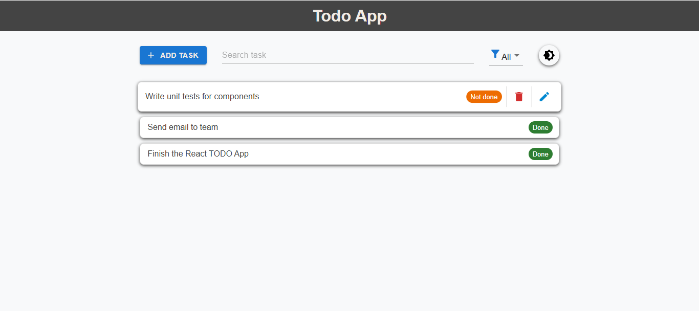
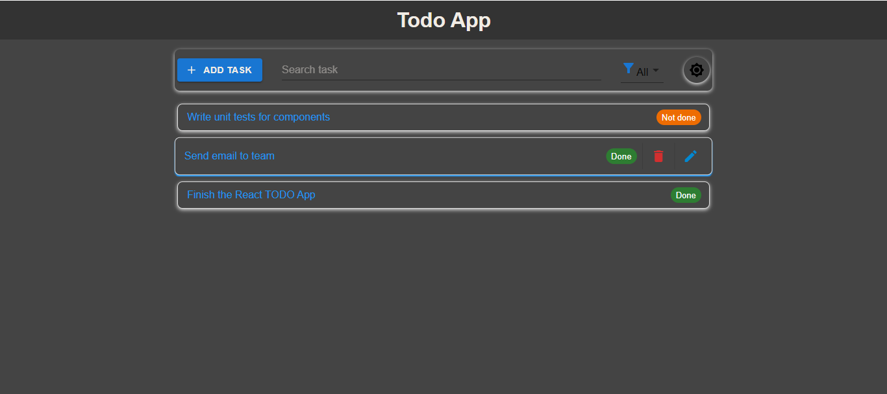

# 📝 TODO App :

> A simple, elegant and functional task management app built with the **MERN stack** (MongoDB, Express, React, Node.js) and Material UI.

---

## 📷 Screenshots




---

## 🧩 Description

A full-stack TODO application designed to help users organize their daily tasks with a clean and intuitive interface.  
The app offers smooth user experience with hover effects, toast notifications, responsive design and optional animations for add/edit/delete actions.

---

## 🔧 Tech Stack

| Tech                   | Usage               |
| ---------------------- | ------------------- |
| **React**              | Frontend            |
| **Redux Toolkit**      | State management    |
| **Express / Node.js**  | Backend API         |
| **MongoDB / Mongoose** | Database            |
| **Material UI**        | UI Components       |
| **Axios**              | API Communication   |
| **react-toastify**     | Toast Notifications |

---

## 🌟 Features

- ✅ Add new tasks
- ✅ Edit task description or status (`isdone`)
- ✅ Delete task with confirmation dialog
- ✅ Filter tasks by text or completion status
- ✅ Hover effect on task items
- ✅ Toast notifications after each action
- ✅ Responsive layout (mobile/tablet/desktop)
- ✅ Optional animations using CSS or Framer Motion

---

## 🚀 How to Run Locally

### 1. Clone the project

```bash
git clone https://github.com/abdallahsekrafi/TODO-MERN.git
cd TODO-MERN
```

### 2. Setup environment variables

#### Backend `.env`

```env
PORT=5000
MONGO_URI=mongodb+srv://...
```

#### Frontend `.env` (inside `/client`)

```env
REACT_APP_API_URL=http://localhost:5000
```

### 3. Install dependencies

#### Backend

```bash
cd backend
npm install
```

#### Frontend

```bash
cd ../client
npm install
```

---

## 🛠 API Endpoints

| Method | Route  | Description       |
| ------ | ------ | ----------------- |
| GET    | `/`    | Get all tasks     |
| POST   | `/`    | Create new task   |
| PUT    | `/:id` | Update task by ID |
| DELETE | `/:id` | Delete task by ID |

---

## 🎨 Design & UX

- 🧾 Clean and modern UI
- 🖌️ Subtle hover effects on task items
- 🎯 Status badges dynamically styled based on task state (`Done`, `Not Done`)
- 📱 Fully responsive layout

---

## 🧪 Best Practices Used

- ✅ Centralized state management with Redux Toolkit
- ✅ Input validation with Joi in backend
- ✅ Custom hooks for filtering and animations
- ✅ Toast notifications after CRUD actions
- ✅ Modal dialogs for editing/deleting tasks
- ✅ Well-structured and reusable components

---

## 📦 Main Dependencies

### Backend

```json
"dependencies": {
  "express": "^4.18.2",
  "mongoose": "^7.0.3",
  "cors": "^2.8.5",
  "dotenv": "^16.0.3",
  "joi": "^17.9.1"
}
```

### Frontend

```json
"dependencies": {
  "@mui/material": "^5.13.0",
  "react-redux": "^8.0.5",
  "reduxjs/toolkit": "^1.9.5",
  "axios": "^1.6.2",
  "react-toastify": "^9.1.3"
}
```

---

## 🧰 Available Scripts

### Backend

```bash
node server.js       # Start the server on http://localhost:5000
```

### Frontend

```bash
npm start       # Run the app on http://localhost:3000
npm build       # Build production version
```

---

## 💼 Technologies Used

<div align="left">
  
  
  
  
  
  
  
  
  
  
  
  
  
  
  
  
  
</div>

---

## 📬 Contact

- **LinkedIn**: [Abdallah Sekrafi](https://www.linkedin.com/in/abdallah-sekrafi-47232889/)
- **Facebook**: [fb.com/abdallah.sek](https://www.facebook.com/abdallah.sek/)
- **GitHub**: [github.com/abdallahsekrafi](https://github.com/abdallahsekrafi)

---

## © Abdallah Sekrafi @ 2025
